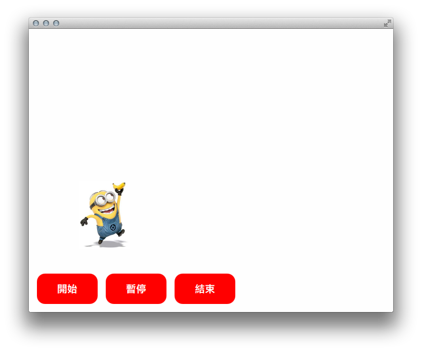

tutorial-qmlminions
===================

2015 成功高中數理資優班班資訊組暑期講座，最後一天的 QML 教學範例；內容物是個簡單的二軸小小兵彈跳裝置。

License
-------

Released under MIT License. 

The Minions image is copyrighted by Universal Pictures. Its purpose is to demonstrate how QML could emulate 2D games (like Nintendo's Mario).
